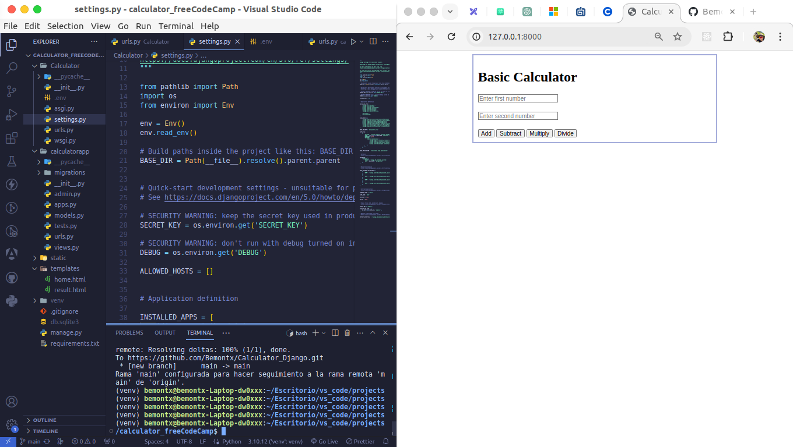

# Calculadora Web con Django

## Calculadora Web con Django
Este proyecto es una calculadora web básica desarrollada utilizando el framework Django de Python. La calculadora realiza operaciones aritméticas simples, como suma, resta, multiplicación y división, y muestra los resultados en tiempo real en la interfaz de usuario.

## Características principales:
Interfaz de usuario intuitiva y fácil de usar.
Capacidad para realizar operaciones aritméticas básicas.
Resultados precisos y actualizados en tiempo real.
Diseño responsive para una experiencia de usuario óptima en dispositivos móviles y de escritorio.

## Tecnologías utilizadas:
- Django: Framework web de alto nivel basado en Python para el desarrollo rápido y eficiente de aplicaciones web.
- HTML: Lenguaje de marcado para la estructura y el contenido de la página web.
- CSS: Lenguaje de estilo para el diseño y la presentación visual de la página web.